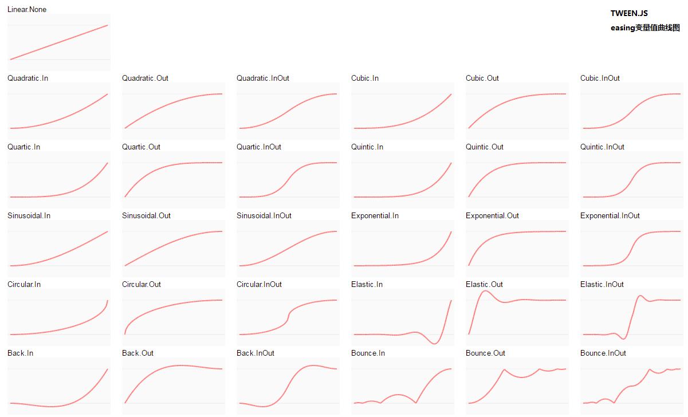

## 4、three.js的其他方法
#### 4.4 TWEEN.js让物体运动
---

使用TWEEN.js插件让物体运动
<span style="font-size: 12px;">插件地址：[http://github.com/sole/tween.js](http://github.com/sole/tween.js)<span>

```javascript
var t = new TWEEN.Tween(
    intersects[0].object.position // 要运动的物体的属性
).to(
    {x: 3000, y: 3000, z: 3000},  // 运动的目标
    1000                          // 完成的时间
).easing(
    TWEEN.Easing.Linear.None      // 运动曲线
).start();

TWEEN.update();
```
TWEEN.Easing运动曲线参考



