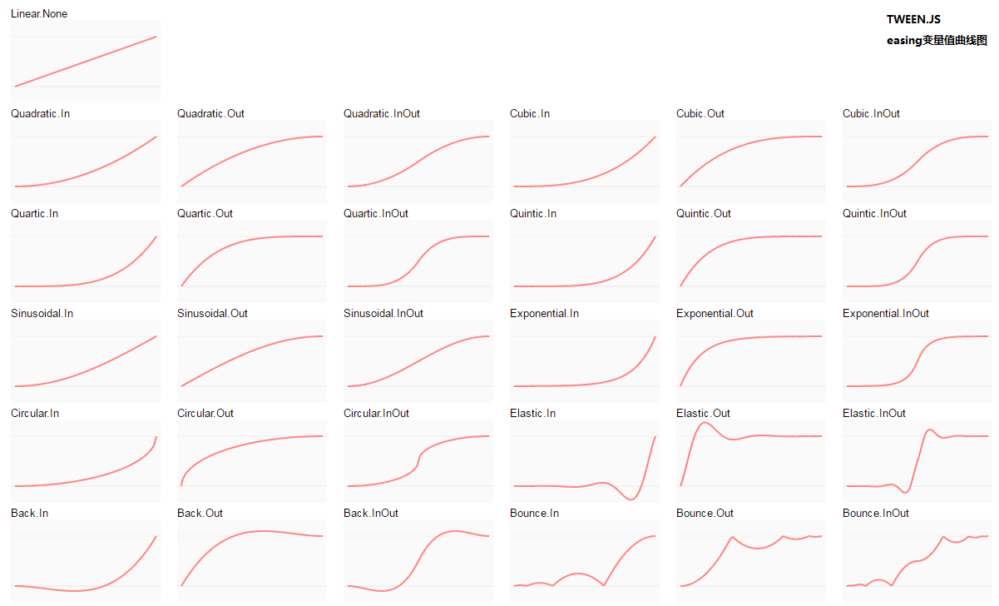

## 4.4、TWEEN.js让物体运动

使用`TWEEN.js`插件让物体运动  
插件地址：[http://github.com/sole/tween.js](http://github.com/sole/tween.js)  

```javascript
var t = new TWEEN.Tween(
  intersects[0].object.position // 要运动的物体的属性
).to(
  {x: 3000, y: 3000, z: 3000},  // 运动的目标
  1000                          // 完成的时间
).easing(
   TWEEN.Easing.Linear.None     // 运动曲线
).start();

TWEEN.update();
```
TWEEN.Easing运动曲线参考
